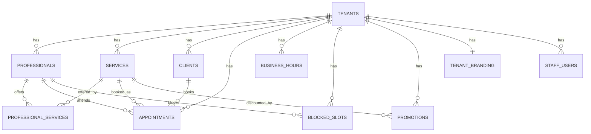

# Modelagem do Banco de Dados — Agenda360

Este documento detalha o modelo de dados do Agenda360, implementando a
estratégia multi-tenant definida em [ARCHITECTURE.md](ARCHITECTURE.md) §2 e
os requisitos funcionais de [REQUIREMENTS.md](REQUIREMENTS.md). O DDL
correspondente está em [`database/schema.sql`](../database/schema.sql).

## 1. Princípios do modelo

- **Shared schema, `tenant_id` em toda tabela de domínio.** Nenhuma tabela
  de negócio existe sem pertencer a um tenant.
- **Row-Level Security (RLS)** habilitado em todas as tabelas com
  `tenant_id`, como rede de segurança além do filtro na aplicação (§5).
- **Domínio genérico (RNF-06):** `professionals` e `services` não têm
  nenhuma coluna específica de barbearia — a v1 só popula esses dados com
  conteúdo de barbearia, mas o schema já serve outros segmentos.
- **UUID como chave primária** em todas as tabelas, para permitir geração
  de IDs no cliente/serviço sem round-trip ao banco e evitar vazamento de
  volume de negócio (IDs sequenciais expõem quantidade de registros).

## 2. Diagrama de Entidades



## 3. Entidades

### 3.1 `tenants`

O negócio cliente (ex.: Carioca Barbearia). Raiz de todo o isolamento
multi-tenant.

| Coluna | Tipo | Observação |
|---|---|---|
| `id` | uuid PK | |
| `slug` | text, único | usado para resolução por subdomínio/app |
| `name` | text | nome de exibição, ex.: "Carioca Barbearia" |
| `segment` | text | `barbershop`, `salon`, `clinic`, `personal_trainer`, `pet_shop`, `other` — informativo, não altera schema |
| `min_cancel_notice_minutes` | integer | prazo mínimo para cancelamento do cliente (RF-CLI-06), default 120 |
| `is_active` | boolean | desativação lógica do tenant |
| `created_at`, `updated_at` | timestamptz | |

### 3.2 `tenant_branding`

Personalização White Label (1:1 com `tenants`), separada para manter
`tenants` enxuta e permitir evoluir branding sem tocar na entidade raiz.

| Coluna | Tipo | Observação |
|---|---|---|
| `tenant_id` | uuid PK/FK → tenants | |
| `display_name` | text | nome exibido no app (pode diferir de `tenants.name`) |
| `logo_url` | text | |
| `icon_url` | text | |
| `primary_color` | text | hex, ex.: `#E30613` |
| `secondary_color` | text | hex |

### 3.3 `staff_users`

Login da Barbearia e do Administrador (o app do cliente final nunca usa
esta tabela — RF-CLI-07 continua sem cadastro/senha).

| Coluna | Tipo | Observação |
|---|---|---|
| `id` | uuid PK | |
| `tenant_id` | uuid FK → tenants | |
| `name` | text | |
| `email` | text | único por tenant (`uq_staff_users_tenant_email`) |
| `password_hash` | text | hash (bcrypt), nunca a senha em texto |
| `role` | text | `staff` (operação do dia a dia, RF-BAR-*) ou `admin` (cadastro, RF-ADM-*) |
| `is_active` | boolean | |
| `created_at`, `updated_at` | timestamptz | |

### 3.4 `professionals`

Prestador do serviço (barbeiro na v1, papel genérico por design).

| Coluna | Tipo | Observação |
|---|---|---|
| `id` | uuid PK | |
| `tenant_id` | uuid FK → tenants | |
| `name` | text | |
| `phone` | text, nullable | |
| `is_active` | boolean | |
| `created_at`, `updated_at` | timestamptz | |

### 3.5 `services`

Serviço oferecido pelo tenant.

| Coluna | Tipo | Observação |
|---|---|---|
| `id` | uuid PK | |
| `tenant_id` | uuid FK → tenants | |
| `name` | text | ex.: "Corte Masculino" |
| `duration_minutes` | integer | RF-ADM-02 |
| `price_cents` | integer, nullable | "a definir" na v1 — nullable até precificação ser decidida; valor em centavos evita erro de ponto flutuante |
| `is_active` | boolean | |
| `created_at`, `updated_at` | timestamptz | |

### 3.6 `professional_services`

Associação N:N — quais profissionais realizam quais serviços (RF-CLI-03).

| Coluna | Tipo | Observação |
|---|---|---|
| `tenant_id` | uuid FK → tenants | redundante por design, ver §5 |
| `professional_id` | uuid FK → professionals | |
| `service_id` | uuid FK → services | |
| PK | `(professional_id, service_id)` | |

### 3.7 `business_hours`

Horário de funcionamento do tenant por dia da semana (RF-ADM-03).

| Coluna | Tipo | Observação |
|---|---|---|
| `tenant_id` | uuid FK → tenants | |
| `weekday` | smallint | 0 = domingo ... 6 = sábado |
| `opens_at` | time, nullable | nulo se `is_closed` |
| `closes_at` | time, nullable | |
| `is_closed` | boolean | dia sem funcionamento |
| PK | `(tenant_id, weekday)` | |

### 3.8 `blocked_slots`

Bloqueios de agenda por profissional (almoço, folga, imprevisto) —
RF-BAR-05.

| Coluna | Tipo | Observação |
|---|---|---|
| `id` | uuid PK | |
| `tenant_id` | uuid FK → tenants | |
| `professional_id` | uuid FK → professionals | |
| `starts_at`, `ends_at` | timestamptz | |
| `reason` | text, nullable | |
| `created_at` | timestamptz | |

### 3.9 `clients`

Cliente final, identificado por telefone dentro do tenant — sem
login/senha (RF-CLI-07). O mesmo telefone reaproveita o cadastro em
agendamentos futuros.

| Coluna | Tipo | Observação |
|---|---|---|
| `id` | uuid PK | |
| `tenant_id` | uuid FK → tenants | |
| `name` | text | |
| `phone` | text | único por tenant, ver `uq_clients_tenant_phone` |
| `created_at`, `updated_at` | timestamptz | |

### 3.10 `appointments`

O agendamento — entidade central do sistema.

| Coluna | Tipo | Observação |
|---|---|---|
| `id` | uuid PK | |
| `tenant_id` | uuid FK → tenants | |
| `client_id` | uuid FK → clients | |
| `professional_id` | uuid FK → professionals | |
| `service_id` | uuid FK → services | |
| `starts_at`, `ends_at` | timestamptz | `ends_at` calculado a partir da duração do serviço no momento do agendamento e persistido (histórico não deve mudar se a duração do serviço for editada depois) |
| `status` | text | `scheduled`, `confirmed`, `cancelled`, `completed`, `no_show` |
| `cancelled_at` | timestamptz, nullable | |
| `cancel_reason` | text, nullable | RF-BAR-04 |
| `created_at`, `updated_at` | timestamptz | |

**Restrição crítica:** dois agendamentos do mesmo profissional não podem se
sobrepor no tempo. Implementada como `EXCLUDE` constraint no PostgreSQL
(extensão `btree_gist`) em vez de checagem só na aplicação — garante
consistência mesmo sob concorrência (dois clientes tentando o mesmo
horário ao mesmo tempo). Ver `schema.sql`.

### 3.11 `promotions`

Promoções associadas a serviços (RF-ADM-04). Modelo simples na v1 — sem
motor de regras.

| Coluna | Tipo | Observação |
|---|---|---|
| `id` | uuid PK | |
| `tenant_id` | uuid FK → tenants | |
| `service_id` | uuid FK → services | |
| `name` | text | |
| `discount_type` | text | `percentage` ou `fixed` |
| `discount_value` | integer | percentual (0-100) ou centavos, conforme `discount_type` |
| `starts_at`, `ends_at` | timestamptz | validade da promoção |
| `is_active` | boolean | |
| `created_at`, `updated_at` | timestamptz | |

## 4. Índices

- Todas as FKs `tenant_id` têm índice — todo acesso multi-tenant filtra por
  ele primeiro.
- `clients (tenant_id, phone)` — único, também é o caminho de busca do
  fluxo de agendamento sem login.
- `appointments (tenant_id, professional_id, starts_at)` — consulta de
  disponibilidade (RF-CLI-04) e agenda do dia/semana (RF-BAR-01/02).
- `appointments EXCLUDE USING gist` — ver §3.10.

## 5. Row-Level Security (RLS)

Toda tabela com `tenant_id` tem RLS habilitado com policy:

```sql
USING (tenant_id = current_setting('app.tenant_id')::uuid)
```

O backend define `app.tenant_id` via `SET LOCAL` no início de cada
transação, a partir do tenant resolvido pela requisição (token, subdomínio
ou app id — ver ARCHITECTURE.md §2.2). Isso significa que, mesmo que um bug
na aplicação esqueça de filtrar por `tenant_id` em uma query, o banco
recusa a fuga de dados entre tenants.

`professional_services` guarda `tenant_id` mesmo sendo uma tabela de
associação (redundante em relação a `professionals`/`services`)
especificamente para permitir RLS direto na tabela, sem precisar de join
para aplicar a policy.

### 5.1 O caso especial de `tenants`

Resolver o tenant a partir do `slug` (§2.2 de ARCHITECTURE.md) é o
primeiro passo de toda requisição — e acontece **antes** de `app.tenant_id`
existir. Se `tenants` tivesse a mesma policy restritiva das outras
tabelas, essa consulta nunca encontraria nada (problema do ovo e da
galinha). Por isso `tenants` tem duas policies separadas: leitura pública
(`FOR SELECT USING (true)` — slug/nome/branding não são dados sensíveis, e
o app do cliente já expõe isso via `GET /v1/tenant`) e escrita restrita ao
próprio tenant. As demais tabelas são consultadas só depois que
`app.tenant_id` já foi definido, então mantêm a policy única de sempre.

### 5.2 Role de aplicação

RLS só protege de verdade se a conexão da API **não** for a dona das
tabelas — no PostgreSQL, o dono (e superusuários) ignoram RLS por padrão,
policies ou não. Por isso o schema cria uma role `agenda360_app`, sem
privilégio de dono, com apenas `SELECT/INSERT/UPDATE/DELETE` concedido
explicitamente. As migrations e o `seed.py` continuam rodando com a role
dona do schema (bypass do RLS é esperado e necessário para elas). O
backend em tempo de execução se conecta como `agenda360_app`.

## 6. Não incluído nesta versão

Conforme REQUIREMENTS.md §5 (fora de escopo no MVP): tabelas de pagamento,
verificação de telefone, notificações e qualquer estrutura para IA. Serão
modeladas quando essas fases do roadmap forem iniciadas.
